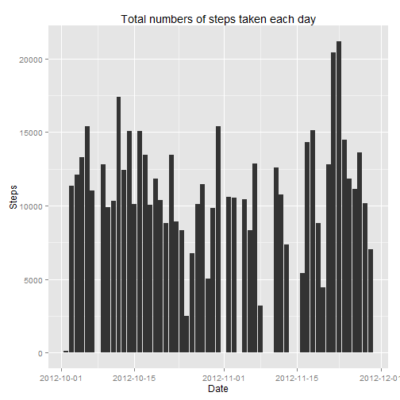
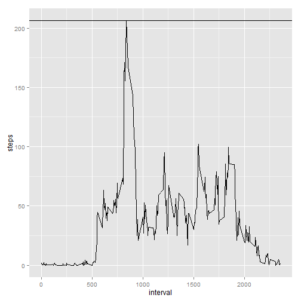
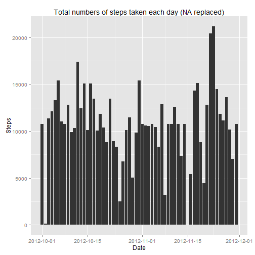
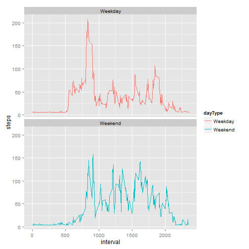

```r
    library(knitr)
    library(ggplot2)
    library(scales)
    setwd("./RepData_PeerAssessment1/")
    opts_chunk$set(echo=TRUE)
```

## Loading and preprocessing the data
1. Download data if it is not downloaded

```r
    if (!file.exists("activity.zip")){
      download.file("http://d396qusza40orc.cloudfront.net/repdata%2Fdata%2Factivity.zip", destfile = "activity.zip", mode="wb")
    }
```

2. Unzip CSV if it is not unzip yet

```r
    if (!file.exists("activity.csv")){
      unzip("activity.zip")
    }
```

3. Load CSV data into variable & transform the date

```r
    data <- read.csv("activity.csv")
    summary(data)
```

```
##      steps                date          interval     
##  Min.   :  0.00   2012-10-01:  288   Min.   :   0.0  
##  1st Qu.:  0.00   2012-10-02:  288   1st Qu.: 588.8  
##  Median :  0.00   2012-10-03:  288   Median :1177.5  
##  Mean   : 37.38   2012-10-04:  288   Mean   :1177.5  
##  3rd Qu.: 12.00   2012-10-05:  288   3rd Qu.:1766.2  
##  Max.   :806.00   2012-10-06:  288   Max.   :2355.0  
##  NA's   :2304     (Other)   :15840
```

## What is mean total number of steps taken per day?

1. Calculate the total number of steps taken per day

```r
    totalSum <- aggregate(steps ~ date, data, sum)
    head(totalSum)
```

```
##         date steps
## 1 2012-10-02   126
## 2 2012-10-03 11352
## 3 2012-10-04 12116
## 4 2012-10-05 13294
## 5 2012-10-06 15420
## 6 2012-10-07 11015
```

2. Make a histogram of the total number of steps taken each day

```r
    ggplot(data, aes(y=steps, x=as.Date(date))) + 
    geom_histogram(stat = "identity") + 
    scale_x_date(labels = date_format("%Y-%m-%d")) + 
    xlab("Date") + 
    ylab("Steps") + 
    ggtitle("Total numbers of steps taken each day")
```

```
## Warning: Removed 2304 rows containing missing values (position_stack).
```

 

3. Calculate and report the mean and median of the total number of steps taken per day

```r
    meanData <- mean(totalSum$steps,na.rm = TRUE)
    medianData <- median(totalSum$steps,na.rm=TRUE)
```
* Mean is 1.0766189 &times; 10<sup>4</sup>.
* Median is 10765.

## What is the average daily activity pattern?

1. Make a time series plot (i.e. type = "l") of the 5-minute interval (x-axis) and the average number of steps taken, averaged across all days (y-axis)

```r
    TotalAvg <- aggregate(steps ~ interval, data, mean)
    ggplot(TotalAvg, aes(interval,steps)) + 
        geom_line() + 
        geom_hline(yintercept = max(TotalAvg$steps))
```

 

2. Which 5-minute interval, on average across all the days in the dataset, contains the maximum number of steps?

```r
    TotalAvg[TotalAvg$steps == max(TotalAvg$steps),]
```

```
##     interval    steps
## 104      835 206.1698
```

## Inputing missing values

1. Calculate and report the total number of missing values in the dataset (i.e. the total number of rows with NAs)

```r
    nrow(data[is.na(data$steps),])
```

```
## [1] 2304
```
2. Devise a strategy for filling in all of the missing values in the dataset. The strategy does not need to be sophisticated. For example, you could use the mean/median for that day, or the mean for that 5-minute interval, etc.

    * I propose to use mean of 5-minute interval to populate the missing values.

3. Create a new dataset that is equal to the original dataset but with the missing data filled in.

```r
    dataNew <- data
    dataNew$steps[is.na(dataNew$steps)] <- mean(TotalAvg$steps)
```

4.1 Make a histogram of the total number of steps taken each day and Calculate and report the mean and median total number of steps taken per day.

```r
    totalSumNew <- aggregate(steps ~ date, dataNew, sum)
    ggplot(dataNew, aes(y=steps, x=as.Date(date))) + 
        geom_histogram(stat = "identity") + 
        scale_x_date(labels = date_format("%Y-%m-%d")) + 
        xlab("Date") + 
        ylab("Steps") + 
        ggtitle("Total numbers of steps taken each day (NA replaced)")
```

 

```r
    meanDataNew <- mean(totalSumNew$steps)
    medianDataNew <- median(totalSumNew$steps,na.rm=TRUE)
```

4.2 Do these values differ from the estimates from the first part of the assignment?

    * Mean is 1.0766189 &times; 10<sup>4</sup>. 
    * Mean(NA replaced) is 1.0766189 &times; 10<sup>4</sup>.
        + This is same for mean.
    
    * Median is 10765. 
    * Median(NA replaced) is 1.0766189 &times; 10<sup>4</sup>.
        + Yes there is minor differences since more mean data has been populated which move the median towards mean.

4.3 What is the impact of imputing missing data on the estimates of the total daily number of steps?
    * Depends on the value being populated to fill the NAs, mean and median maybe tweak slightly.

## Are there differences in activity patterns between weekdays and weekends?
1. Create a new factor variable in the dataset with two levels - "weekday" and "weekend" indicating whether a given date is a weekday or weekend day.

```r
    dataNewWeek <- dataNew
    dataNewWeek$dayType <- "Weekday"
    weekend <- weekdays(as.Date(dataNewWeek$date)) %in% c("Saturday","Sunday")
    dataNewWeek$dayType[weekend == TRUE] <- "Weekend"
    dataNewWeek$dayType <- as.factor(dataNewWeek$dayType)
    summary(dataNewWeek)
```

```
##      steps                date          interval         dayType     
##  Min.   :  0.00   2012-10-01:  288   Min.   :   0.0   Weekday:12960  
##  1st Qu.:  0.00   2012-10-02:  288   1st Qu.: 588.8   Weekend: 4608  
##  Median :  0.00   2012-10-03:  288   Median :1177.5                  
##  Mean   : 37.38   2012-10-04:  288   Mean   :1177.5                  
##  3rd Qu.: 37.38   2012-10-05:  288   3rd Qu.:1766.2                  
##  Max.   :806.00   2012-10-06:  288   Max.   :2355.0                  
##                   (Other)   :15840
```

2. Make a panel plot containing a time series plot (i.e. type = "l") of the 5-minute interval (x-axis) and the average number of steps taken, averaged across all weekday days or weekend days (y-axis). See the README file in the GitHub repository to see an example of what this plot should look like using simulated data.


```r
    TotalAvgNewWeek <- aggregate(steps ~ interval + dayType, dataNewWeek, mean)
    ggplot(TotalAvgNewWeek, aes(x=interval,y=steps,group=dayType)) + 
        geom_line(aes(color=dayType)) + 
        facet_wrap(~ dayType, nrow=2)
```

 
